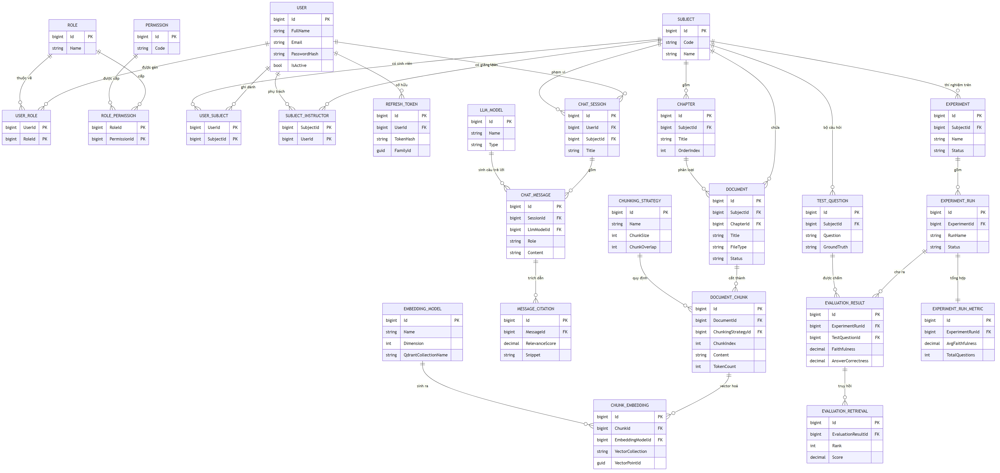
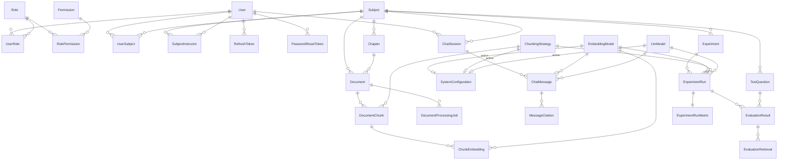

# Sơ đồ cơ sở dữ liệu

Có **2 sơ đồ**, mỗi cái gồm **ảnh PNG** (xem ngay) và **file draw.io** (sửa được).

| Sơ đồ | Ảnh | File draw.io | Dùng khi nào |
|---|---|---|---|
| **1. ERD** (khái niệm) | [ERD.png](ERD.png) | [ERD.drawio](ERD.drawio) | Trình bày, báo cáo — gọn, dễ nhìn |
| **2. Database Diagram** (vật lý) | [DatabaseDiagram.png](DatabaseDiagram.png) | [ChatbotDb.drawio](ChatbotDb.drawio) | Tra cứu khi code — đầy đủ cột, quy tắc xoá |

> Mở file `.drawio` bằng [draw.io](https://app.diagrams.net) hoặc extension
> *Draw.io Integration* trong VS Code (sửa trực tiếp trong IDE).

**31 bảng · 42 khoá ngoại · 4 schema** — sinh từ metadata thật của database, đã đối chiếu khớp 100%
(bỏ `__EFMigrationsHistory` và `hangfire.*` vì là bảng hệ thống).

| Schema | Vai trò | Số bảng |
|---|---|---|
| `auth` | Người dùng, vai trò, quyền, token | 9 |
| `dbo` | Môn học, tài liệu, chat, cấu hình, audit | 14 |
| `rag` | Chunk và địa chỉ vector | 2 |
| `rbl` | Nghiên cứu / benchmark | 6 |

---

## Sơ đồ 1 — ERD (khái niệm)

Tập trung vào **thực thể và quan hệ**, chỉ liệt kê thuộc tính chính. Phù hợp để trình bày.

*File sửa được: [ERD.drawio](ERD.drawio) — 26 thực thể, 34 quan hệ*

---

## Sơ đồ 2 — Database Diagram (vật lý)

**Đầy đủ 352 cột kèm kiểu dữ liệu thật** (`nvarchar(300)`, `decimal(7,6)`, `datetime2`...),
đánh dấu PK/FK, ký hiệu quan hệ crow's foot. Ảnh lớn — mở riêng để phóng to.

*File sửa được: [ChatbotDb.drawio](ChatbotDb.drawio) — 31 bảng, 42 khoá ngoại, có thêm quy tắc xoá
(Cascade / Restrict / SetNull) trên từng mũi tên*

---

## Tổng quan quan hệ (Mermaid)

---

## Các cụm bảng

### `auth` — Người dùng & phân quyền

| Bảng | Vai trò |
|---|---|
| `User` | Tài khoản. `SecurityStamp` đổi → thu hồi mọi token đang sống |
| `Role` · `Permission` | RBAC: Admin / Lecturer / Student |
| `UserRole` · `RolePermission` | Bảng nối (khoá chính kép) |
| `UserSubject` | Sinh viên ghi danh môn — **quyết định thấy tài liệu nào** |
| `SubjectInstructor` | Giảng viên phụ trách môn — **quyết định ai được upload** |
| `RefreshToken` | Lưu SHA-256. Dùng lại token cũ → thu hồi cả họ (`FamilyId`) |
| `PasswordResetToken` | Token đặt lại mật khẩu, dùng một lần |

### `dbo` — Môn học & tài liệu

| Bảng | Vai trò |
|---|---|
| `Subject` → `Chapter` → `Document` | Cây nội dung |
| `Document` | Metadata file. **File thật nằm trên đĩa**, DB chỉ giữ `RelativePath` |
| `DocumentProcessingJob` | Theo dõi ingest: `Parse → Chunk → Embed → Index` |

### `rag` — Chunk & vector

| Bảng | Vai trò |
|---|---|
| `DocumentChunk` | Văn bản đã cắt. Grain = (Document, Strategy, Index) — **text lặp lại theo từng chiến lược** để benchmark so sánh được |
| `ChunkEmbedding` | **Chỉ lưu địa chỉ** vector: `VectorCollection` + `VectorPointId` |

> **Vector thật nằm ở Qdrant, không nằm trong SQL Server.** `ChunkEmbedding` là cầu nối giữa
> hai hệ thống. `VectorPointId` là UUIDv5 tất định sinh từ `(chunkId, embeddingModelId)` →
> ingest lại sẽ **ghi đè** thay vì tạo bản trùng.

### `dbo` — Chat

| Bảng | Vai trò |
|---|---|
| `ChatSession` | Phiên chat, gắn với 1 môn. 3 cột `Pinned*` cho phép **ghim model riêng**, đè cấu hình chung |
| `ChatMessage` | Tin nhắn (chỉ thêm mới). Ghi lại model đã dùng để truy vết |
| `MessageCitation` | Trích dẫn nguồn. `DocumentTitle` **cố ý lưu lặp** để lịch sử chat còn đọc được sau khi tài liệu bị xoá |

### `dbo` — Cấu hình & model

| Bảng | Vai trò |
|---|---|
| `SystemConfiguration` | **Singleton `Id = 1`** — cấu hình đang chạy |
| `EmbeddingModel` | `QdrantCollectionName` là nguồn chân lý cho tên collection |
| `ChunkingStrategy` | `ChunkSize` / `ChunkOverlap` tính bằng **token** |
| `LlmModel` | Model chat và judge |
| `AppSetting` | Cờ bật/tắt linh tinh |

> `SystemConfiguration` nằm ở **DB**, không phải code. Sửa code seed không đổi được DB đang chạy.
> Đổi lúc runtime qua `PUT /api/v1/admin/config` (xem [PIPELINES.md](../PIPELINES.md)); đổi cố định
> theo mã nguồn thì phải viết migration.

### `rbl` — Nghiên cứu / benchmark

| Bảng | Vai trò |
|---|---|
| `Experiment` | Một thí nghiệm |
| `TestQuestion` | Câu hỏi + **đáp án chuẩn** (do người soạn) |
| `ExperimentRun` | Một tổ hợp *embedding × chunking × llm* |
| `EvaluationResult` | Kết quả + 5 điểm RAGAS cho từng câu |
| `EvaluationRetrieval` | Chunk đã lấy về — để truy vết vì sao điểm thấp |
| `ExperimentRunMetric` | Trung bình cho dashboard (**1:1** với run) |

---

## Quy tắc xoá

| Kiểu | Nghĩa | Ví dụ |
|---|---|---|
| **Cascade** | Xoá cha → xoá con | Xoá `Document` → xoá hết `DocumentChunk` |
| **Restrict** | Chặn xoá nếu còn tham chiếu | Không xoá được `EmbeddingModel` nếu còn chunk dùng nó |
| **SetNull** | Xoá cha → con thành NULL | Xoá `Chapter` → `Document.ChapterId = NULL` (tài liệu vẫn còn) |

**Soft-delete:** `User`, `Subject`, `Chapter`, `Document`, `ChatSession`, `Experiment`,
`TestQuestion` có cột `IsDeleted` — EF tự lọc, dữ liệu không mất thật.

---

## Ghi chú khi đọc sơ đồ

**Ba trục cấu hình** (`EmbeddingModel`, `ChunkingStrategy`, `LlmModel`) được tham chiếu từ 4 nơi:
`SystemConfiguration` (mặc định) · `ChatSession` (ghim riêng) · `ExperimentRun` (benchmark) ·
`DocumentChunk`/`ChunkEmbedding` (dữ liệu đã sinh). Đây là lý do **đổi embedding model thì phải
ingest lại**, còn đổi model chat thì không — xem [PIPELINES.md](../PIPELINES.md).

**`hangfire.*`** (11 bảng) do Hangfire tự tạo để quản lý job nền, không thuộc thiết kế nghiệp vụ
nên không vẽ.

**Nguồn dữ liệu:** entity tại [src/Chatbot.Domain/Entities/](../src/Chatbot.Domain/Entities/),
ánh xạ bảng tại [src/Chatbot.Infrastructure/Persistence/Configurations/](../src/Chatbot.Infrastructure/Persistence/Configurations/).

---

## Sửa lại sơ đồ

Ảnh PNG được render từ mã Mermaid, file `.drawio` sinh bằng script từ metadata database.
Nếu schema đổi (thêm bảng, thêm cột), cách cập nhật:

1. **Sửa nhanh:** mở `.drawio`, kéo thả trực tiếp rồi *File → Export as → PNG* đè lên ảnh cũ.
2. **Sinh lại từ đầu:** chạy lại script sinh — đọc `INFORMATION_SCHEMA` và `sys.foreign_keys`
   nên luôn khớp database thật.

Khi thêm migration đổi schema, nhớ cập nhật cả 2 sơ đồ để tài liệu không lệch với code.
